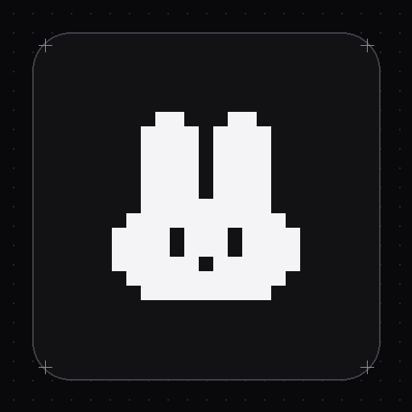

<p align="center">
  
</p>

<h1 align="center">Gridline Portfolio Template</h1>

<p align="center">
  <strong>Template de portfólio para desenvolvedores com estética minimalista arquitetural, sintetizador de som Web Audio e minigames retrô.</strong><br>
  <em>Construído com Next.js 15 (App Router), React 19, Tailwind CSS e TypeScript.</em>
</p>

<p align="center">
  <a href="README.md">🇺🇸 English</a>
  &nbsp;&nbsp;&nbsp;|&nbsp;&nbsp;&nbsp;
  <a href="README.pt.md">🇧🇷 Português</a>
  &nbsp;&nbsp;&nbsp;|&nbsp;&nbsp;&nbsp;
  <a href="https://gabrielbaiano.vercel.app/" target="_blank">🌐 Demonstração ao Vivo</a>
  &nbsp;&nbsp;&nbsp;|&nbsp;&nbsp;&nbsp;
  <a href="https://github.com/GabrielBaiano/gridline-portfolio-template/generate">⚡ Usar Template</a>
  &nbsp;&nbsp;&nbsp;|&nbsp;&nbsp;&nbsp;
  <a href="https://github.com/GabrielBaiano/gridline-portfolio-template/archive/refs/heads/main.zip">📦 Baixar ZIP</a>
</p>

<p align="center">
  <a href="https://github.com/GabrielBaiano/gridline-portfolio-template/blob/main/LICENSE">
    
  </a>
  
  
  
  <a href="https://github.com/GabrielBaiano/gridline-portfolio-template/stargazers">
    
  </a>
</p>

---

<p align="center">
  <a href="https://gabrielbaiano.vercel.app/" target="_blank">
    <strong>🌐 Demonstração ao Vivo: https://gabrielbaiano.vercel.app/</strong>
  </a>
</p>

O **Gridline Portfolio Template** é um modelo de portfólio pessoal com foco em engenharia e arquitetura visual limpa. Ele utiliza um container de 690px com bordas pontilhadas estilo blueprint, sintetizador de som nativo sem arquivos de áudio pesados, heatmap de contribuições em Server Components e minigames ocultos em canvas.

> 📚 **Evolução do Projeto**: Criado como uma alternativa minimalista e de alta densidade técnica aos modelos genéricos de portfólio estilo SaaS, priorizando APIs nativas do navegador (Web Audio API, gráficos SVG, Server Components) em vez de pacotes pesados no cliente.

## 🎓 Funcionalidades Principais

* **Design em Grid Arquitetural**: Container central de 690px com bordas pontilhadas lineares (`repeating-linear-gradient`) e banners interativos de dot-grid em canvas.
* **Sintetizador Web Audio em Memória**: Zero dependências de arquivos MP3 ou pacotes externos de som. Efeitos sintetizados em tempo real via PCM `AudioBuffer` para micro-sons de hover (`tick`), clique mecânico (`press`), switches (`toggle`), aplausos (`chime`) e som de limite atingido (`error`).
* **Heatmap de Atividade em Server Component**: Calendário de contribuições estilo GitHub gerado em build-time como React Server Component (0 KB de dados no bundle do cliente), com auto-scroll suave para as datas mais recentes no celular e no desktop.
* **Blog Técnico com Blocos de Código**: Rotas dedicadas (`/blog/[slug]`), cópia de código com 1 clique, estimativa de tempo de leitura, feed RSS completo (`/feed.xml`) e `sitemap.xml` dinâmico.
* **Contador de Aplausos Táteis e Visitas**: Sistema interativo de claps com partículas flutuantes de `+1` e feedback tátil (o botão treme e toca som de bloqueio ao atingir o limite de 10 claps). Contador de visitantes em tempo real com persistência opcional via Upstash Redis.
* **Minigames Retrô em Canvas**:
  * **Snake Game**: Clique triplo no banner superior para jogar com setas/WASD ou toques na tela mobile.
  * **Space Invaders**: Clique triplo no banner inferior para enfrentar ondas de aliens com disparos de laser, fagulhas em partículas, pontuação ao vivo e efeitos de áudio.
* **Agendamento Direto de Reuniões**: Ação "Book a call" integrada diretamente com a sua agenda no [Cal.com](https://cal.com).
* **Dark e Light Mode**: Alternância de tema persistida no `localStorage` com detecção de preferência do sistema operacional.

## 🛠️ Tecnologias Utilizadas

* **Framework**: Next.js 15 (App Router, Turbopack, React Server Components)
* **Linguagem**: TypeScript 5
* **Estilização**: Tailwind CSS, PostCSS
* **Ícones**: Lucide React
* **Persistência (Opcional)**: Upstash Redis (`@upstash/redis`) para métricas globais

## 🚀 Como Usar e Baixar

### 📥 3 Formas de Começar

1. **Usar como Template no GitHub (Recomendado)**: Clique em **[Usar este template](https://github.com/GabrielBaiano/gridline-portfolio-template/generate)** para criar uma cópia limpa diretamente na sua conta do GitHub.
2. **Criar via Degit**:
   ```bash
   npx degit GabrielBaiano/gridline-portfolio-template meu-portfolio
   cd meu-portfolio
   pnpm install
   ```
3. **Baixar o Pacote ZIP**:
   - Baixe o pacote compactado: **[gridline-portfolio-template.zip](https://github.com/GabrielBaiano/gridline-portfolio-template/archive/refs/heads/main.zip)**
   - Extraia os arquivos e instale as dependências com `pnpm install`.

### 💻 Desenvolvimento Local

```bash
# Clone o repositório
git clone https://github.com/GabrielBaiano/gridline-portfolio-template.git

# Acesse a pasta do projeto
cd gridline-portfolio-template

# Instale as dependências
pnpm install

# Inicie o servidor local
pnpm dev
```

Abra [http://localhost:3000](http://localhost:3000) no seu navegador.

### 📦 Gerar Pacote de Distribuição Local

Para empacotar uma versão limpa do template em arquivo ZIP sem pastas de build ou `.git`:

```bash
pnpm package
```

## 🌐 Personalização do Conteúdo

Todos os dados pessoais, experiências, projetos, artigos e links sociais ficam centralizados em um único arquivo de configuração:

👉 **`src/data/portfolio.ts`** (também disponível como `portfolio.config.ts`)

### Seções Configuráveis:

- **`personal`**:
  - `name`: Seu nome de exibição.
  - `role`: Seu cargo ou especialidade (ex: `Full-Stack Engineer`).
  - `avatar`: Caminho da sua foto (ex: `/images/logo/avatar.jpg`).
  - `statusBadge`: Status de disponibilidade (ex: `Open for opportunities`).
  - `bio`: Biografia em múltiplos parágrafos.
  - `email`: E-mail direto para contato.
  - `calendarUrl`: Link do seu Cal.com (deixe vazio `""` para ocultar o botão).
- **`socials`**: Links de redes (GitHub, LinkedIn, X, Telegram, e-mail e site pessoal).
- **`experiences`**: Histórico profissional com período, empresa, cargo, conquistas e tecnologias.
- **`projects`**: Projetos em destaque com imagens, links de demonstração, repositórios e textos descritivos.
- **`blogs`**: Artigos técnicos completos com seções, snippets de código, tempo estimado de leitura e tags.
- **`skills`**: Habilidades categorizadas por área (Linguagens, Frameworks, Cloud, Bancos de dados).

## ☁️ Deploy na Vercel

O deploy leva menos de dois minutos:

1. Suba o código para o seu repositório no GitHub.
2. Acesse o [Dashboard da Vercel](https://vercel.com/dashboard) e clique em **Add New... > Project**.
3. Importe o repositório do `gridline-portfolio-template`.
4. Configure as variáveis de ambiente necessárias (em **Project Settings > Environment Variables**):

```ini
# URL canônica para SEO, sitemap.xml e feed RSS
NEXT_PUBLIC_SITE_URL=https://seu-dominio.vercel.app

# Opcional: Upstash Redis para persistir views e claps após reinicializações serverless
UPSTASH_REDIS_REST_URL=https://...upstash.io
UPSTASH_REDIS_REST_TOKEN=AX...
```

5. Clique em **Deploy**.

> **Configuração do Upstash Redis**: Sem as chaves do Redis, o contador de visitas e aplausos roda em memória de forma transparente. Para persistência global duradoura, crie um banco gratuito no [Upstash](https://upstash.com) (ou use a integração oficial no marketplace da Vercel) e adicione as credenciais REST na Vercel.

## 🎮 Easter Eggs Retrô

Ambos os banners pontilhados em canvas contêm minigames escondidos:

- **Snake Game (Banner Superior)**: Dê um clique triplo rápido (3 cliques em menos de 750ms) no banner superior. Controle pelas setas do teclado ou `WASD`, ou arraste no celular. Pressione `Esc` para sair.
- **Space Invaders (Banner Inferior)**: Dê um clique triplo rápido no banner inferior. Controle a nave com `← / →` ou arraste do mouse, atire com `Espaço` ou toque na tela. Conta com ondas de aliens, placar, colisão de escudo e efeitos sonoros sintetizados.

## 💻 Scripts Disponíveis

| Comando | Descrição |
| --- | --- |
| `pnpm dev` | Inicia o servidor local de desenvolvimento na porta 3000 |
| `pnpm build` | Compila o build otimizado de produção com SSG |
| `pnpm start` | Executa o build de produção localmente |
| `pnpm package` | Gera o arquivo compactado ZIP do template |
| `pnpm tsc --noEmit` | Validação estática de tipos TypeScript |

## 🤝 Contribuindo

Contribuições, correções de bugs e sugestões são sempre bem-vindas! Sinta-se à vontade para abrir uma issue ou enviar um Pull Request.

## 📄 Licença

Este projeto está licenciado sob a [Licença MIT](LICENSE) - consulte o arquivo [LICENSE](LICENSE) para mais detalhes.

---

<p align="center">
  Feito com ❤️ por <a href="https://github.com/GabrielBaiano" target="_blank">GabrielBaiano</a>
</p>
